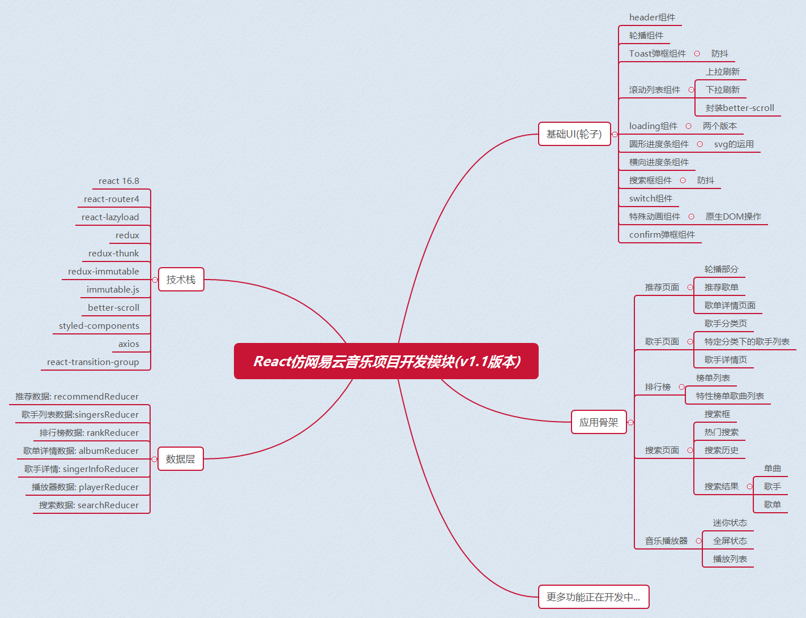

# 项目介绍

## 在线地址

[项目说明](https://sanyuan0704.github.io/react-cloud-music/chapter1/)

## 项目整体架构

这是我们即将开发的版本，大家可以看到，这个项目还是稍微有一些复杂的，相信大家跟着做完会有非常大的收获。

## 技术栈分解

* react v16.8: 用于构建用户界面的 MVVM 框架
* redux: 著名JavaScript状态管理容器
* redux-thunk: 处理异步逻辑的redux中间件
* immutable: Facebook历时三年开发出的进行持久性数据结构处理的库 (它和memo、Redux搭配就是神器，memo包裹函数组件跟PureComponent是一样的效果，在组件更新前进行数据的浅层比较，具体请参考这篇文章[当 PureComponent 遇上 ImmutableJS](https://segmentfault.com/a/1190000011408775#articleHeader3))
* react-lazyload: react懒加载库
* better-scroll: 提升移动端滑动体验的知名库
* styled-components: 处理样式，体现css in js的前端工程化神器(详情请移步我之前的文章[styled-components:前端组件拆分新思路](https://juejin.im/post/5d1ae68fe51d454f7230255d))
* axios: 用来请求后端api的数据

## 开发代码风格

在开始这个项目之前，我有必要强调一个这个项目工程的开发规范和我个人的编码风格，提前告知一下，我这么做也是有自己充分的理由的，让项目可读性和可维护性尽可能高，希望后面看到一些奇葩的操作不要感到奇怪。

1、class组件不再用，全面拥抱hooks，统一用函数组件。

2、组件内部状态用hooks处理，凡是业务数据全部放在redux中管理。

3、ajax请求以及后续数据处理的具体代码全部放在actionCreator中，由redux-thunk进行处理，尽可能精简组件代码。

4、每一个容器组件都有自己独立的reducer，然后再全局的store下通过redux的combineReducer方法合并。

5、JS变量名(包括函数名)采用小驼峰的方式，组件名或者styled-components导出的样式容器名都采用大驼峰，常量名所有字母大写。

6、普通CSS类名全部用英语小写，单词间用下划线连接，CSS动画钩子类名中单词用-连接。

7、凡是props中有数据的，全部在组件最前面提前解构赋值，并且，获得的属性名和方法名要分开声明，从父组件获得的props和通过react-redux中映射获得的props也要分开声明。

8、useEffect统一写在最前面，并且紧跟着props解构赋值代码后面。

9、凡是负责返回JSX的函数，统一聚集在函数最后面，中间不要穿插事件处理函数和其他逻辑。

10、mapDispatchToProps返回的函数中，函数名格式为xxxDispatch，以免和现有action名冲突。

## 通过这个项目你能获得哪些提升？

* 熟练使用React Hooks进行业务开发，理解哪些场景产生闭包陷阱，如何避免掉坑。
* 掌握React + Redux的工程化编码的全流程。
* 封装常用的移动端组件，实现常见的需求，如封装滚动组件、实现图片懒加载、实现上拉/下拉刷新的功能、实现防抖功能、实现组件代码分割(CodeSpliting)等等(可参考项目架构图)。
* 拥有实现前端复杂交互的实际项目经验，提升自己的内功，比如开发播放器内核就是其中一个很大很大的挑战。
* 掌握CSS中的诸多技巧，提升自己的CSS能力，无论布局还是动画，都有相当多的实践和探索，并且一种效果会给出多种不同的方案，大家打开项目预览地址可以自己体会。
* 封装JS第三方包，实现从开发、测试到发布全流程。
* 彻底理解redux原理，并能够独立开发redux的中间件。

看到这里你是不是有一点心动？哈哈，别高兴的太早。其实要掌握这些内容着实不容易，要经历的还有很多狠多，我个人能力也有限，无法保证你100%能够消化掉这些东西，但我唯一可以保证的是:

这个系列拆解文章我会百分之百地投入，将我在开发中所经历的坑和解决问题的过程毫无保留地分享给各位，对于一些大家可能会感到陌生的概念和语法都会一五一十地摊开来说，做到真正的"手摸手"。对于里面涉及的代码，我首先会再markdown中自己写一遍，然后把自己当作小白，对照vuepress博客的开发界面再自己从头到尾实现一遍，给大家足够的技术安全感。

但是本系列拆解文章也不是针对前端纯小白的，由于基础部分过于科普太多基础内容很多小伙伴会厌倦，所以需要你有一定的前端知识的储备，具体来说是指CSS常用的布局方式和属性，原生JavaScript的基础，ES6的常用语法，React和Redux的基本使用。

## 推荐学习资料

如果有些你还不会，我推荐你先去学习一下这些资料:
[阮一峰ES6入门](http://es6.ruanyifeng.com/#docs/module)

[技术胖React全家桶及React Hooks完整免费教程](https://jspang.com/posts/2019/05/04/new-react-base.html)
